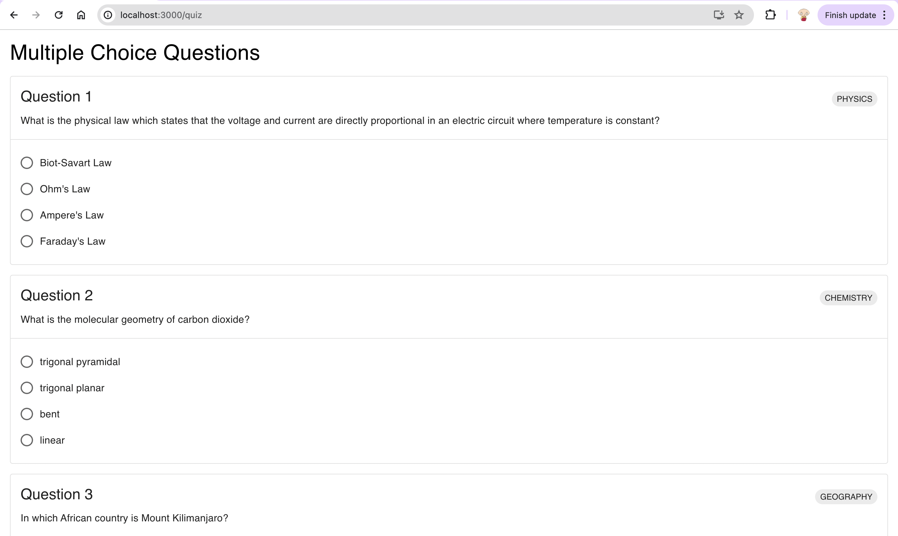

# A Quiz for Everyone
## Introduction
I like general knowledge and I especially enjoy quiz shows and games. This application contains a list of multiple-choice questions where each question has four options, but only one is correct (similar to the British tv game show, [_"Who Wants to be a Millionaire"_](https://en.wikipedia.org/wiki/Who_Wants_to_Be_a_Millionaire%3F_(British_game_show))).

## Architecture
### Database
A PostgreSQL database is used to store the questions and options. For now, there is no _user_ entity. The application may be expanded upon later to include users and to keep a scoreboard for all users who participate. There are two tables, namely **QUESTION** and **OPTION**. Here are the data structures of each table, respectively:   

**QUESTION**
```
questionId: int
questionText: string
subject: string
correctOptionId: int
```

**OPTION**
```
optionId: int
optionText: string
owningQuestionId: int
```

An option has multiple questions, but only one option is correct.    

Assuming PostgreSQL is installed on the system (MacOs or Linux), the `postgres` shell can be entered with:
```bash
psql postgres
```
Once inside the shell, a user and password can be created with
```bash
CREATE USER newUser WITH PASSWORD 'user_password';
```
The user can be given permission to create a new database with
```bash
ALTER ROLE newUser CREATEDB;
```
To test if the `newUser` can login successfully, the session can be ended and then the user can login:
```bash
\q
psql postgres -U newUser
```

### Client (Frontend)
The frontend is to be built using the [React](https://react.dev/learn) web framework and [Material UI](https://mui.com/material-ui/getting-started/) for the React components. Both Javascript and Typescript are valid options for the programming language, but I have chosen to use Typescript. The frontend source code can be found in the `frontend` directory.  

### Server (Backend)
The backend is to be built using the [Express](https://expressjs.com/) library with Typescript as the programming language. The backend code is stored inside the `backend` directory.   

The `/quiz` page, which is where the multiple choice questions are displayed, can be seen below (minimal styling):
